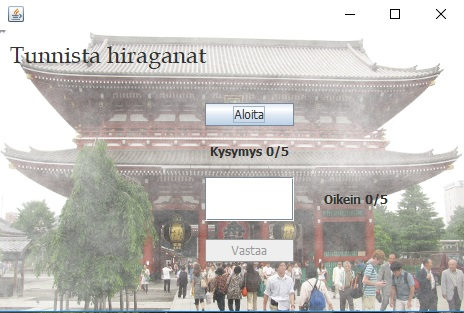
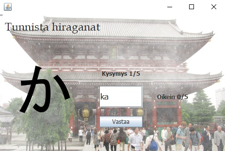
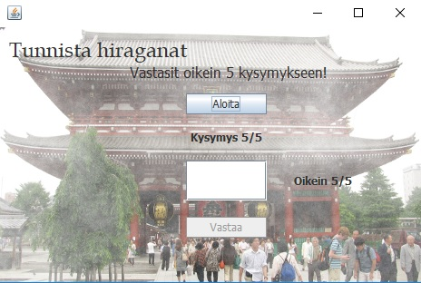

# Hiraganatesti
This application is meant for testing your knowledge of the Japanese hiragana syllabary. It has a simple quiz mechanism which asks you to write the romanized name of the character shown, using the <a href="https://en.wikipedia.org/wiki/Hepburn_romanization">Hepburn romanization</a>. It marks 5 rounds, after which it shows the final score and gives the user an opportunity to start over. 

The GUI is in Finnish, however it is quite irrelevant in this application. Press the button "Aloita" to begin the test. 

"Vastaa" confirms the answer. 

At the end the amount of correct answers is shown.  

